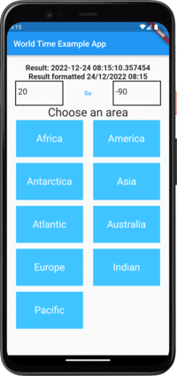

## 1.0.6

A Flutter package to get the time of a specific time zone or geo location.  
It also includes an easy to use formatter for DateTime with customizable formatting.

# Features

1. Get current **time** from **EZ Time Zone**
2. Get current time from **Latitude** and **Longitude**.
3. Format a **Flutter DateTime object** to a pretty _String formatted_ text to your liking.



# Short example code

```
import 'package:worldtime/worldtime.dart';

final _worldtimePlugin = Worldtime();

final String myFormatter = 'time - \\h:\\m, date - \\D/\\M/\\Y';

final DateTime timeAmsterdamTZ = await _worldtimePlugin
    .timeByCity('Europe/Amsterdam');

final DateTime timeAmsterdamGeo = await _worldtimePlugin
    .timeByLocation(latitude: 52.3676, longitude: 4.9041);

final String resultTZ = _worldtimePlugin
    .format(dateTime: timeAmsterdamTZ,formatter:myFormatter);

final String resultGeo = _worldtimePlugin
    .format(dateTime: timeAmsterdamGeo,formatter:myFormatter);
```

# Walk through

Import the plugin

```
import 'package:worldtime/worldtime.dart';
```

Initiate the plugin

```
final _worldtimePlugin = Worldtime();
```

Create a formatter.

```
final String myFormatter = 'time - \\h:\\m, date - \\D/\\M/\\Y';
```

## Example with TZ Time Zone

Get the time in Amsterdam.

```
final DateTime timeAmsterdamTZ = await _worldtimePlugin
    .timeByCity('Europe/Amsterdam');
```

Put the value in a new variable.

```
final String resultTZ = _worldtimePlugin
    .format(dateTime: timeAmsterdamTZ,formatter:myFormatter);
```

Print the variable.

```
print(result);
```

## Example with Coordinates

Amsterdam's coordinates are:
52.3676° N, 4.9041° E => **latitude: 52.3676, longitude: 4.9041**  
Get the time in Amsterdam's coordinates.

```
final DateTime timeAmsterdamGeo = await _worldtimePlugin.
    timeByLocation(
        latitude: 52.3676,
        longitude: 4.9041,
    );
```

We will use the same formtter. ('time - \\h:\\m, date - \\D/\\M/\\Y')  
Put the value in a new variable.

```
final String resultGeo = _worldtimePlugin.
    format(
        dateTime: timeAmsterdamGeo,
        formatter:myFormatter,
    );
```

Print the variable.

```
print(resultGeo);
```
